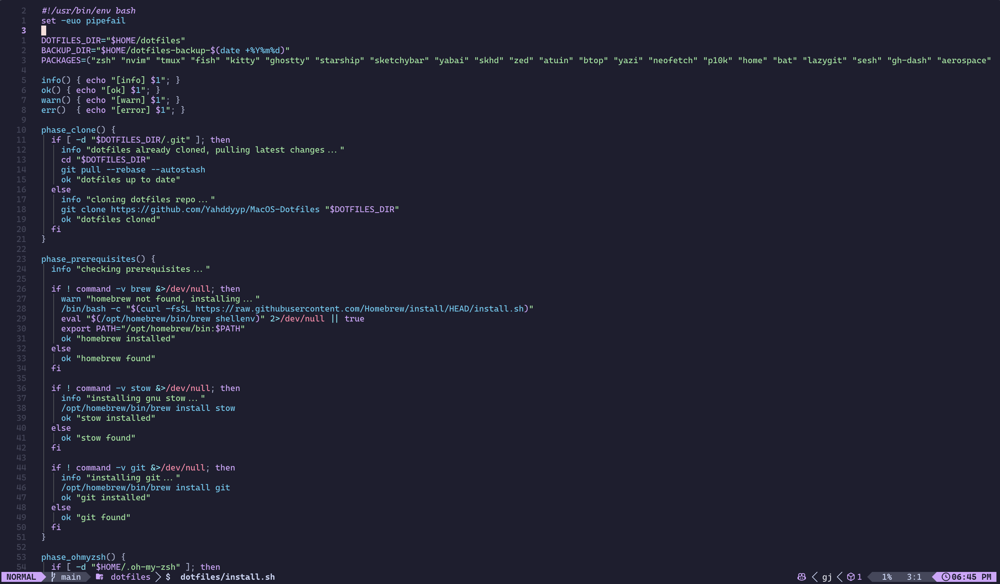

# mauve.nvim



<p align="center"><b>A dark and colourful theme for neovim with the catppuccin mocha palette for mauve lovers.</b></p>

## Installation

Install with your favorite plugin manager:

[lazy.nvim](https://github.com/folke/lazy.nvim)

```lua
{
  "Yahddyyp/mauve.nvim",
  lazy = false,
  priority = 1000,
}
```

[packer.nvim](https://github.com/wbthomason/packer.nvim)

```lua
use {
  "Yahddyyp/mauve.nvim",
}
```

[vim-plug](https://github.com/junegunn/vim-plug)

```vim
Plug 'Yahddyyp/mauve.nvim'
```

## Usage

To make `mauve` your default colorscheme, add the following line to your `init.lua` after you have set up the plugin:

```lua
vim.cmd("colorscheme mauve")
```

This will apply the colorscheme every time you start Neovim.

## Supported Plugins

*   [Telescope](https://github.com/nvim-telescope/telescope.nvim)
*   [Blink.cmp](https://github.com/Saghen/blink.cmp)
*   [Fidget](https://github.com/j-hui/fidget.nvim)
*   Some [Snacks](https://github.com/sontungexpt/snacks.nvim) plugins
*   [Tree-sitter](https://github.com/nvim-treesitter/nvim-treesitter)
*   [Noice.nvim](https://github.com/folke/noice.nvim)
*   [Git Signs](https://github.com/lewis6991/gitsigns.nvim)
*   [Lualine](https://github.com/nvim-lualine/lualine.nvim)
*   [Grug-Far](https://github.com/MagicDuck/grug-far.nvim)

## Lualine

Add this to your lualine config as i cant figure out how to get lualine to switch automatically. 

```lua
require('lualine').setup {
  options = {
    -- ... your other lualine options
    theme = require('mauve-nvim.integrations.lualine')
  }
}
```

## Special Thanks

*  [Catppuccin](https://github.com/catppuccin/catppuccin) for making me fall in love with these colors.

<p align="center"></p>

<p align="center"><a href="https://github.com/yahddyyp/mauve.nvim/blob/main/LICENSE"></a></p>

